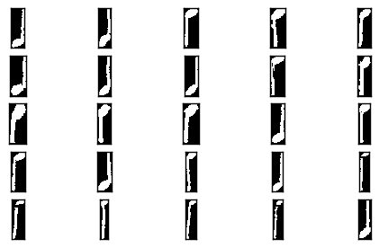
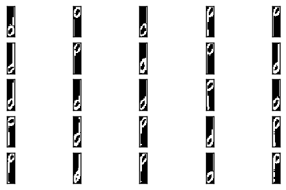

.. _tutorial:

MUSCIMA++ Tutorial
==================

This is a tutorial for using the ``muscima`` package to work with the
MUSCIMA++ dataset.

We assume you have already gone through the README and downloaded the
dataset. Let's load it.

.. code:: python

    import os
    from muscima.io import read_nodes_from_file
    
    # Change this to reflect wherever your MUSCIMA++ data lives
    CROPOBJECT_DIR = os.path.join(os.environ['HOME'], 'data/MUSCIMA++/v0.9/data/cropobjects')
    
    cropobject_fnames = [os.path.join(CROPOBJECT_DIR, f) for f in os.listdir(CROPOBJECT_DIR)]
    docs = [read_nodes_from_file(f) for f in cropobject_fnames]

Let's do something straightforward: symbol classification.

Symbol Classification
---------------------

Let's try to tell apart quarter notes from half notes.

However, notes are recorded as individual primitives in MUSCIMA++, so we
need to extract notehead-stem pairs from the data using their
relationships. Quarter notes are all ``full-notehead``-``stem`` pairs
with no beam or flag. Half-notes are all ``empty-notehead``-``stem``
pairs.

After we extract the note classes, we will need to compute features for
classification. To do that, we first need to "draw" the symbols in the
appropriate relative positions. Then, we can extract whatever features
we need.

Finally, we train a classifier and evaluate it.

Extracting notes
~~~~~~~~~~~~~~~~

.. code:: python

    # Bear in mind that the outlinks are integers, only valid within the same document.
    # Therefore, we define a function per-document, not per-dataset.
    
    def extract_notes_from_doc(cropobjects):
        """Finds all ``(full-notehead, stem)`` pairs that form
        quarter or half notes. Returns two lists of Node tuples:
        one for quarter notes, one of half notes.
        
        :returns: quarter_notes, half_notes
        """
        _cropobj_dict = {c.objid: c for c in cropobjects}
        
        notes = []
        for c in cropobjects:
            if (c.clsname == 'noteheadFull') or (c.clsname == 'notehead-empty'):
                _has_stem = False
                _has_beam_or_flag = False            
                stem_obj = None
                for o in c.outlinks:
                    _o_obj = _cropobj_dict[o]
                    if _o_obj.clsname == 'stem':
                        _has_stem = True
                        stem_obj = _o_obj
                    elif _o_obj.clsname == 'beam':
                        _has_beam_or_flag = True
                    elif _o_obj.clsname.endswith('flag'):
                        _has_beam_or_flag = True
                if _has_stem and (not _has_beam_or_flag):
                    # We also need to check against quarter-note chords.
                    # Stems only have inlinks from noteheads, so checking
                    # for multiple inlinks will do the trick.
                    if len(stem_obj.inlinks) == 1:
                        notes.append((c, stem_obj))
        
        quarter_notes = [(n, s) for n, s in notes if n.clsname == 'noteheadFull']
        half_notes = [(n, s) for n, s in notes if n.clsname == 'notehead-empty']
        return quarter_notes, half_notes
    
    qns_and_hns = [extract_notes_from_doc(cropobjects) for cropobjects in docs]

Now, we don't need the ``objid`` anymore, so we can lump the notes from
all 140 documents together.

.. code:: python

    import itertools
    qns = list(itertools.chain(*[qn for qn, hn in qns_and_hns]))
    hns = list(itertools.chain(*[hn for qn, hn in qns_and_hns]))
    
    len(qns), len(hns)

.. parsed-literal::

    (4320, 1181)

It seems that we have some 4320 isolated quarter notes and 1181 isolated
half-notes in our data. Let's create their images now.

Creating note images
~~~~~~~~~~~~~~~~~~~~

Each notehead and stem Node has its own mask and its bounding box
coordinates. We need to combine these two things, in order to create a
binary image of the note.

.. code:: python

    import numpy
    
    def get_image(cropobjects, margin=1):
        """Paste the cropobjects' mask onto a shared canvas.
        There will be a given margin of background on the edges."""
        
        # Get the bounding box into which all the objects fit
        top = min([c.top for c in cropobjects])
        left = min([c.left for c in cropobjects])
        bottom = max([c.bottom for c in cropobjects])
        right = max([c.right for c in cropobjects])
        
        # Create the canvas onto which the masks will be pasted
        height = bottom - top + 2 * margin
        width = right - left + 2 * margin
        canvas = numpy.zeros((height, width), dtype='uint8')
        
        for c in cropobjects:
            # Get coordinates of upper left corner of the Node
            # relative to the canvas
            _pt = c.top - top + margin
            _pl = c.left - left + margin
            # We have to add the mask, so as not to overwrite
            # previous nonzeros when symbol bounding boxes overlap.
            canvas[_pt:_pt+c.height, _pl:_pl+c.width] += c.mask
            
        canvas[canvas > 0] = 1
        return canvas
    
    qn_images = [get_image(qn) for qn in qns]
    hn_images = [get_image(hn) for hn in hns]

Let's visualize some of these notes, to check whether everything worked.
(For this, we assume you have matplotlib. If not, you can skip this
step.)

.. code:: python

    import matplotlib.pyplot as plt
    
    def show_mask(mask):
        plt.imshow(mask, cmap='gray', interpolation='nearest')
        plt.show()
    
    def show_masks(masks, row_length=5):
        n_masks = len(masks)
        n_rows = n_masks // row_length + 1
        n_cols = min(n_masks, row_length)
        fig = plt.figure()
        for i, mask in enumerate(masks):
            plt.subplot(n_rows, n_cols, i+1)
            plt.imshow(mask, cmap='gray', interpolation='nearest')
        # Let's remove the axis labels, they clutter the image.
        for ax in fig.axes:
            ax.set_yticklabels([])
            ax.set_xticklabels([])
            ax.set_yticks([])
            ax.set_xticks([])
        plt.show()
        

.. code:: python

    show_masks(qn_images[:25])
    show_masks(hn_images[:25])

.. image:: output_12_1.png

It seems that the extraction went all right.

Feature Extraction
~~~~~~~~~~~~~~~~~~

Now, we need to somehow turn the note images into classifier inputs.

Let's get some inspiration from the setup of the HOMUS dataset. In their
baseline classification experiments, the authors just resized their
images to 20x20. For notes, however, this may not be such a good idea,
because it will make them too short. Let's instead resize to 40x10.

.. code:: python

    from skimage.transform import resize
    
    qn_resized = [resize(qn, (40, 10)) for qn in qn_images]
    hn_resized = [resize(hn, (40, 10)) for hn in hn_images]
    
    # And re-binarize, to compensate for interpolation effects
    for qn in qn_resized:
        qn[qn > 0] = 1
    for hn in hn_resized:
        hn[hn > 0] = 1

How do the resized notes look?

.. code:: python

    show_masks(qn_resized[:25])
    show_masks(hn_resized[-25:])

.. image:: output_17_0.png

Classification
~~~~~~~~~~~~~~

We now need to add the output labels and make a train-dev-test split out
of this.

Let's make a balanced dataset, to keep things simpler.

.. code:: python

    # Randomly pick an equal number of quarter-notes.
    n_hn = len(hn_resized)
    import random
    random.shuffle(qn_resized)
    qn_selected = qn_resized[:n_hn]

Now, create the output labels and merge the data into one dataset.

.. code:: python

    
    Q_LABEL = 1
    H_LABEL = 0
    
    qn_labels = [Q_LABEL for _ in qn_selected]
    hn_labels = [H_LABEL for _ in hn_resized]
    
    
    
    notes = qn_selected + hn_resized
    # Flatten data
    notes_flattened = [n.flatten() for n in notes]
    labels = qn_labels + hn_labels

Let's use the ``sklearn`` package for experimental setup. Normally, we
would do cross-validation on data of this small size, but for the
purposes of the tutorial, we will stick to just one train/test split.

.. code:: python

    from sklearn.model_selection import train_test_split
    
    X_train, X_test, y_train, y_test = train_test_split(
        notes_flattened, labels, test_size=0.25, random_state=42,
        stratify=labels)

What could we use to classify this data? Perhaps a k-NN classifier might
work.

.. code:: python

    from sklearn.neighbors import KNeighborsClassifier
    
    K=5
    
    # Trying the defaults first.
    clf = KNeighborsClassifier(n_neighbors=K)
    clf.fit(X_train, y_train)

.. parsed-literal::

    KNeighborsClassifier(algorithm='auto', leaf_size=30, metric='minkowski',
               metric_params=None, n_jobs=1, n_neighbors=5, p=2,
               weights='uniform')

Let's run the classifier now and evaluate the results.

.. code:: python

    y_test_pred = clf.predict(X_test)

.. code:: python

    from sklearn.metrics import classification_report
    print(classification_report(y_test, y_test_pred, target_names=['half', 'quarter']))

.. parsed-literal::

                 precision    recall  f1-score   support
    
           half       0.98      0.87      0.92       296
        quarter       0.88      0.98      0.93       295
    
    avg / total       0.93      0.93      0.93       591
    

NOT BAD.
^^^^^^^^

Apparently, most mistakes happen when half-notes are classified as
quarter-notes. Also, remember that we made the train/test split
randomly, so there are almost certainly notes from each writer both in
the test set and in the training data. This is ripe picking for the kNN
classifier.

Can we perhaps quantify that effect?

...and that is beyond the scope of this tutorial.
